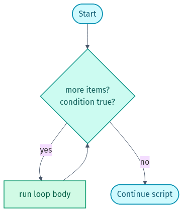

# Part 3 — Loops (Doing Things Again and Again)

*Every loop is this cycle — check the condition, run the body, repeat:*

<picture><source media="(prefers-color-scheme: dark)" srcset="../docs/03-loops-dark.png"></picture>

## 🎯 Goal
Make your scripts repeat work for you: go through a list or a file, read input one line at a time, and keep trying until something is ready.

## 🧠 What you practise here
- `for` loops (go through a list, file names, or use the counting `for ((...))` form)
- `while` loops (the common "read a file one line at a time" pattern)
- `until` loops (keep going *until* something becomes true — great for retrying)
- Loop control: `break` (stop the loop) and `continue` (skip to the next round)
- Reading files safely with `while IFS=... read -r line`
- Adding up values and doing simple maths with `$(( ))`

---

## 📝 The 3 exercises

| # | File | What it tests |
|---|------|---------------|
| 1 | `exercise-1-salary-report.sh` | `for` loop + maths + `continue` |
| 2 | `exercise-2-log-analyzer.sh`  | `while read` to go through a file line by line |
| 3 | `exercise-3-health-check.sh`  | `until` loop + `break` (the retry pattern) |

Run them like this:

```bash
bash 03-loops/exercise-1-salary-report.sh
bash 03-loops/exercise-2-log-analyzer.sh
bash 03-loops/exercise-3-health-check.sh web-03
```

Ready-made answers are in [`solutions/`](solutions).

🎉 Finished all three parts? You have now revised the core of everyday shell scripting. Go back to the [main README](../README.md) and share your fork on LinkedIn!

---

## ⭐ Found this useful?
Please **star** ⭐, **fork** 🍴, and **share** 🔗 this repo on LinkedIn so others can use it too. Want to add an exercise or fix something? See [CONTRIBUTING.md](../CONTRIBUTING.md).

Made by **Shubham Sharma** · [GitHub](https://github.com/shubhs248) · [LinkedIn](https://www.linkedin.com/in/shubhs248)
