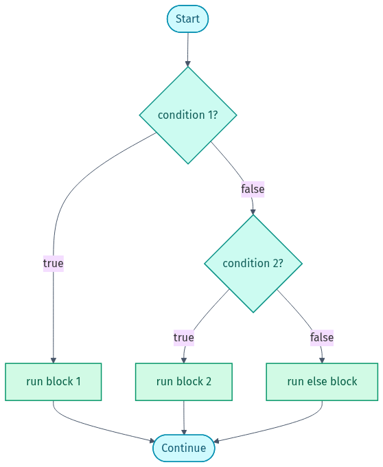

# 🖼️ Diagram Gallery — Linux & Shell

Rendered diagrams for this lab in **light + dark**. They adapt to your GitHub theme below; grab the files directly for slides or LinkedIn.

- Light: `NN-name.png` / `.svg` · Dark: `NN-name-dark.png` / `.svg`
- Editable Mermaid source lives in [`src/`](src). Re-render from the repo root with `render-diagrams.ps1`.

## 🎨 Colour legend
| Colour | Means |
|--------|-------|
| 🔵 Cyan | input / start / end |
| 🟢 Teal / Green | commands & actions |
| 🟠 Amber | files / data |
| 🔴 Rose | destructive / danger |
| ⚪ Slate | external |

---

### How a shell pipeline works
Each command is a filter; data flows left to right (`cmd | cmd | cmd`).

<picture><source media="(prefers-color-scheme: dark)" srcset="01-pipeline-dark.png"></picture>

### if / elif / else flow
<picture><source media="(prefers-color-scheme: dark)" srcset="02-conditionals-dark.png"></picture>

### Loop flow (for / while)
<picture><source media="(prefers-color-scheme: dark)" srcset="03-loops-dark.png"></picture>

---

Made by **Shubham Sharma** · [GitHub](https://github.com/shubhs248) · [LinkedIn](https://www.linkedin.com/in/shubhs248)
